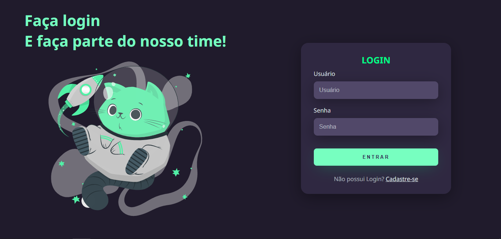

# 📕 Descrição
Projeto realizado com base nos módulos de HTML e CSS avançados do curso DevQuest, foi criado uma tela de login dark com layout responsivo e SVG animado

[Clique aqui para acessar](https://edu-almeidaf.github.io/tela-de-login-dark/)


# 🔧 Ferramentas Utilizadas
- HTML5
- CSS3


# 💡Lições aprendidas
```JavaScript
let licoesAprendidas = [
 'Flexbox',
 'Transitions',
 'Responsividade',
 'Animações' 
]